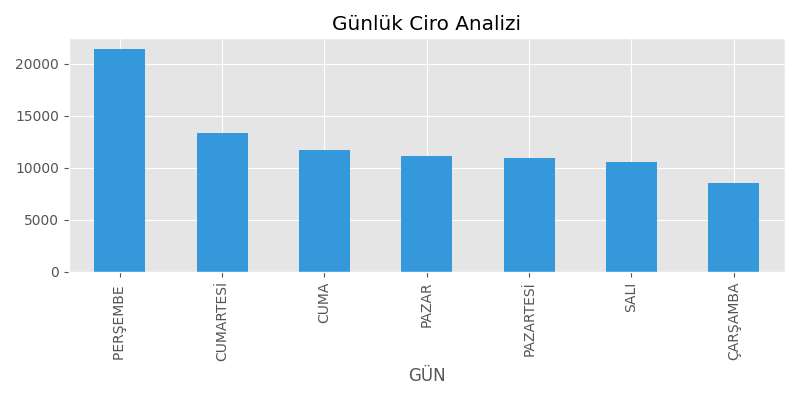

# 📊 Sales Data Analysis & Automated Reporting System

This project is a Python-based application that analyzes sales data from CSV files and automatically generates visualizations and PDF reports.
## 📷 Preview



## 🚀 Features
- Read CSV data using Pandas
- Calculate daily revenue
- Identify the busiest sales day
- Analyze product performance
- Compute average basket value
- Create charts with Matplotlib
- Generate automated PDF reports
- Simple file selection interface with Tkinter

## 🛠️ Technologies Used
- Python
- Pandas
- Matplotlib
- FPDF
- Tkinter

## ⚙️ Installation

```bash
pip install -r requirements.txt

